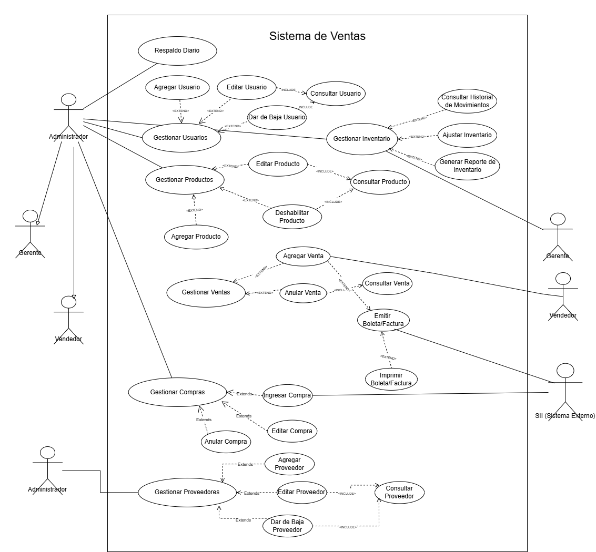
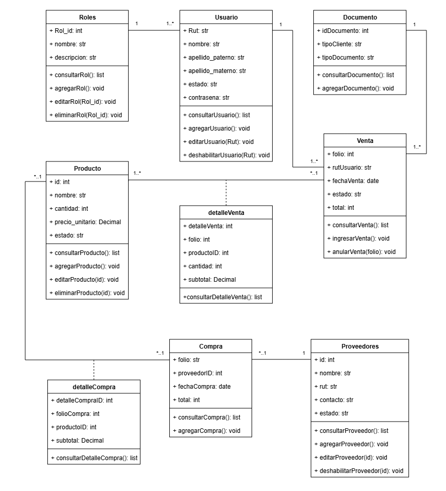
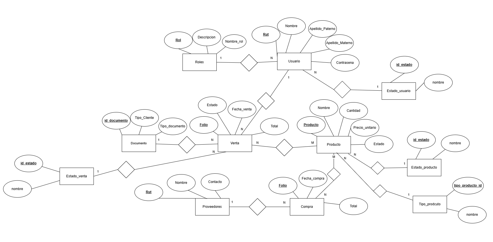
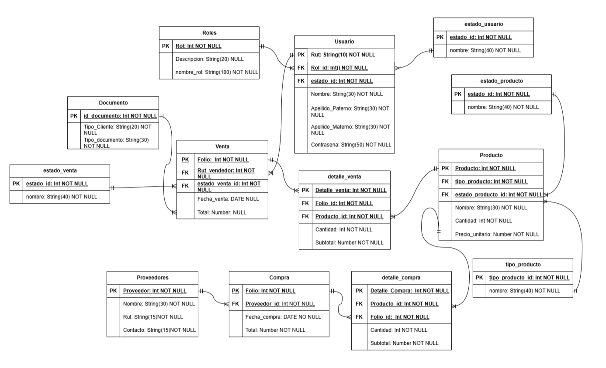

# Sistema de Gestión de Ventas - "MiniYa!"

Este repositorio contiene el código fuente y la documentación del **Sistema de Gestión de Ventas** diseñado para la empresa de comercio minorista "MiniYa!". El proyecto busca automatizar procesos manuales, mejorar el control de inventario y facilitar la emisión de documentos tributarios.

## Equipo de Desarrollo
**Roles y Miembros:**
* **Desarrollador:** Marco Milanca
* **Desarrollador:** Marcos Villaroel
* **Desarrollador:** Juaquin Álvarez

---

## Contexto del Proyecto

### Situación Actual
La empresa "MiniYa!", ubicada en San Carlos de Apoquindo 568, realiza actualmente la gestión de sus operaciones de manera manual. Las ventas se anotan en registros físicos y el inventario se controla mediante revisiones visuales, lo que genera desorden administrativo.

### Problemática Detectada
1. **Registros de productos inexistentes:** Falta de certeza sobre el stock real.
2. **Robos no calculables:** Ausencia de métodos para cuantificar pérdidas.
3. **Errores en ventas:** Precios desactualizados o errores de cobro manual.
4. **Información poco clara:** Registros confusos que dificultan la contabilidad.

### Solución Propuesta
Implementación de un software de escritorio que centraliza la información en una base de datos segura.
* **Gestión Integral:** Módulos para Usuarios, Productos, Ventas y Proveedores.
* **Automatización:** Descuento automático de stock al vender.
* **Respaldo:** Copias de seguridad automáticas a las 02:00 AM.
* **Legal:** Conexión para emisión de boletas/facturas (SII).

---

## Requerimientos del Sistema

### Funcionales
| ID | Requerimiento | Descripción |
| :--- | :--- | :--- |
| R1-R4 | Gestión de Usuarios | CRUD completo (Agregar, Editar, Deshabilitar, Consultar) de usuarios. |
| R5-R8 | Gestión de Productos | CRUD completo de productos e inventario. |
| R9-R12 | Gestión de Ventas | Ingresar, editar, anular y consultar ventas |
| R13-R14 | Inventario | Ingreso y consulta de stock en tiempo real. |
| R15-R17 | Proveedores | Registro y administración de datos de proveedores. |
| R18-R20 | Compras | Registro de compras para abastecimiento de stock. |

### No Funcionales
* **Diseño:** Interfaz minimalista y moderna.
* **Interoperabilidad:** Conexión con servicios del SII.
* **Seguridad:** Backups diarios automatizados.

---

## Diagramas del Sistema

### Diagrama de Casos de Uso
Muestra las interacciones principales de los usuarios (Administrador, Vendedor) con el sistema.

### Diagrama de Clases
Representa la estructura del sistema, definiendo los atributos y métodos de las clases principales (Producto, Venta, Usuario, etc.).

### Modelo de Base de Datos (MER)
Estructura de las tablas y sus relaciones para soportar el inventario y las ventas.

### Diagrama Lógico / Físico
Detalle de campos, llaves primarias y foráneas de la base de datos.

---

## Arquitectura y Datos

### Diccionario de Datos (Resumen)
El sistema utiliza una base de datos relacional. A continuación se describen las entidades principales basadas en el diagrama lógico:

#### Tabla: Usuario
Almacena el personal con acceso al sistema.
* **Rut (PK):** Identificador único.
* **Rol_id (FK):** Nivel de permiso (Admin, Vendedor).
* **Datos:** Nombre, Apellidos, Contraseña (Encriptada).

#### Tabla: Producto
Inventario disponible.
* **Producto_id (PK):** Código único.
* **Nombre/Descripción:** Detalles del artículo.
* **Cantidad:** Stock actual (se descuenta con ventas, aumenta con compras).
* **Precio_unitario:** Valor de venta.

#### Tabla: Venta
Cabecera de la transacción.
* **Folio (PK):** Número único de venta.
* **Estado:** Completada / Anulada.
* **Total:** Monto final de la transacción.
* **Relación:** Conecta con `detalle_venta` (productos específicos) y `Usuario` (quién vendió).

### Integración con SII
Para cumplir con la normativa fiscal chilena, el sistema implementa una conexión simplificada:
1.  Al confirmar una venta, el sistema genera un paquete de datos.
2.  Se conecta vía internet con el servicio de facturación electrónica.
3.  Obtiene el **Folio** oficial y lo registra en la base de datos local.
4.  Permite la generación del documento PDF para el cliente.
